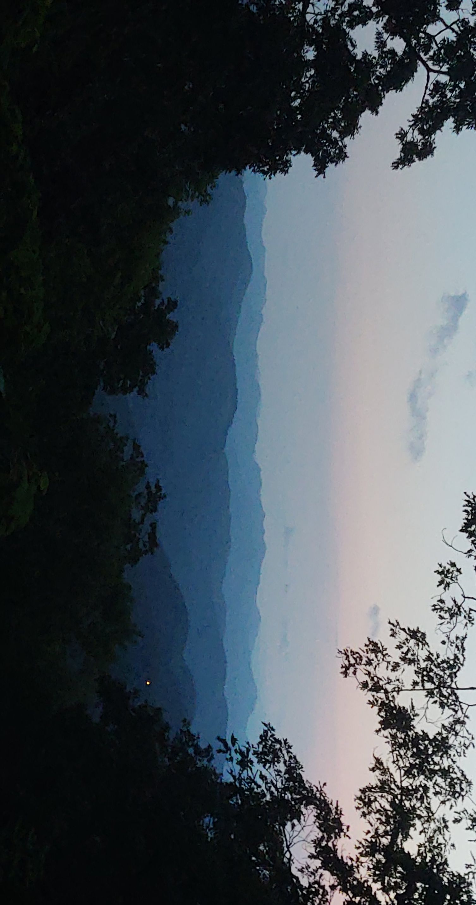

Hello!

First, let me begin by thanking for you reading my blog. I am JC. I come from the beautiful mountains of North Carolina (pictured below). 

I like to grow a wide variety of plants in the garden of my mind. Some topics I enjoy are programming, mathematics, the German language (Ich spreche ein bisschen Deutsch :] ), and basketball (go hornets :\[ ). For the past few years I have worked as a math/computer science tutor where I get to help students grow in their appreciation and knowledge for these subjects. I have also worked as a math researcher on multiple projects involving hypergraphs, graph theory, and Ramsey theory. Through my research, I have had the great honor of presenting some of my work at both the Joint Mathematics Meeting in Denver, Colorado and at The University of North Carolina at Greensboro.

Many of us come from circumstances that make learning a challenge. Despite this fact, I believe everyone has the potential to learn. I speak from experience. I am a first generation college student. In fact, neither of my parents finished highschool. In fact, I myself never finished highschool and instead obtained my G.E.D. Through much hard work, determination, and great support I went from having never taken math course to obtaining degrees in both mathematics and computer science. If I can do it, you can do it too. 

I hope you have enjoyed getting to know me and I hope you find my blog to be useful and insightful. 

Machs gut!
